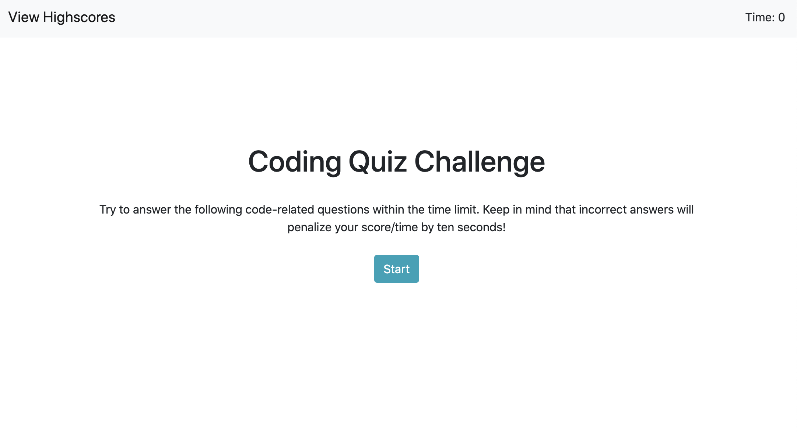
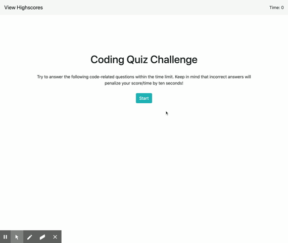

# A Simple Code Quiz

Explore the [project page](https://github.com/cynthiwu/code-quiz)
View it live on [github-pages](https://cynthiwu.github.io/code-quiz/)

## Table of Contents
- [About The Project](#about-the-project)
  - [Acceptance Criteria](#acceptance-criteria)
- [Usage](#usage)
  - [Demo](#demo)
- [Built With](#built-with)
- [Contributing](#contributing)
- [Contact](#contact)


## About The Project

The goal of this project was to create a simple code quiz that tests the user on their basic knowledge of web development. The quiz is timed, with the final time at quiz completion being a recorded score. The quicker the completion, the higher the score, the higher the ranking. Final scores are tracked on a separate webpage which can be accessed by the user.  



### Acceptance Criteria

The below were the acceptance criteria for this project:

```
GIVEN I am taking a code quiz
WHEN I click the start button
THEN a timer starts and I am presented with a question
WHEN I answer a question
THEN I am presented with another question
WHEN I answer a question incorrectly
THEN time is subtracted from the clock
WHEN all questions are answered or the timer reaches 0
THEN the game is over
WHEN the game is over
THEN I can save my initials and score
```

## Usage

This project can be used by anyone who wishes to test their knowledge of the fundamentals of web development, and maybe get a little competitive doing it. 

### Demo

Watch the gif below to see how the quiz works. 




## Built With

* This project was built using [Bootstrap](https://getbootstrap.com/).


## Contact

Cynthia Wu - [@cynthia21wu](https://twitter.com/cynthia21wu) - cynthia21wu@gmail.com

Project Link: [https://github.com/cynthiwu/code-quiz](https://github.com/cynthiwu/code-quiz)
